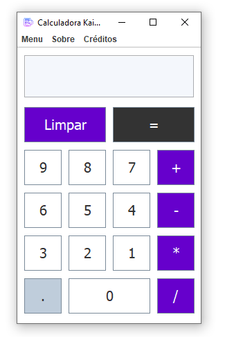
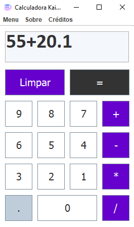
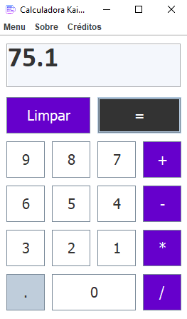
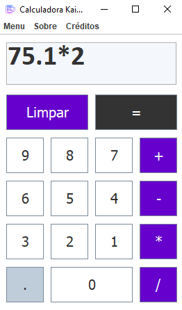
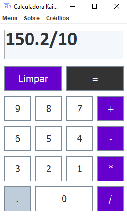
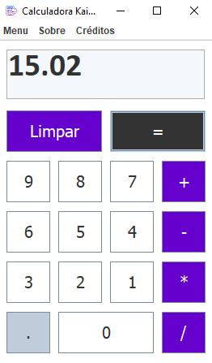
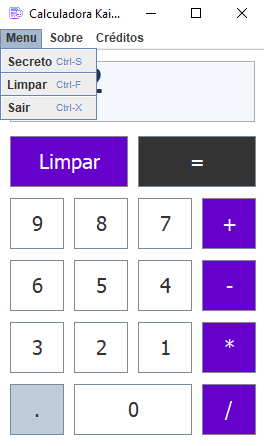

<h2 align="center">
  Calculadora em Java com interface gráfica
</h2>

 <a href="#-sobre-o-projeto">Sobre</a> •
 <a href="#-tecnologias">Tecnologias</a> • 
 <a href="#-app">App</a> • 
 <a href="#-calculos">Calculos</a> •
 <a href="#-menu">Menu</a> •
 <a href="#-como-executar">Executar</a> 

## 💻 Sobre o projeto

Esse projetinho foi desenvolvindo apenas para colocar alguns conceitos em prática da utilização de interface gráfica na linguagem Java.
Ao executar o programa, ele abre uma interface com um menu e todos os números e operações básicas para você usar e fazer os calculos necessários. 

---

## 🛠 Tecnologias

As seguintes ferramentas foram usadas na construção do projeto:

-   **Java**
-   -    **Windowbuilder**

## 🚀 APP

  

## 🚀 CALCULOS

  
  
  
  
  

## 🚀 MENU

  

## 🛠 COMO EXECUTAR
Só baixar os arquivos e executar o arquivo CalculadoraJava.jar  
É necessário ter o **JRE e o JDK** instalados para a execução do arquivo.jar. 

Caso contrário, pode usar uma IDE que tenha suporte a linguagem Java, como por exemplo o Eclipse.  
Com os arquivos do projeto baixado, vai em **Import projects from file system or archive** e importa o repositório.  
Ele vai carregar todas as packages e class do projeto, em seguida é só compilar e rodar!  
